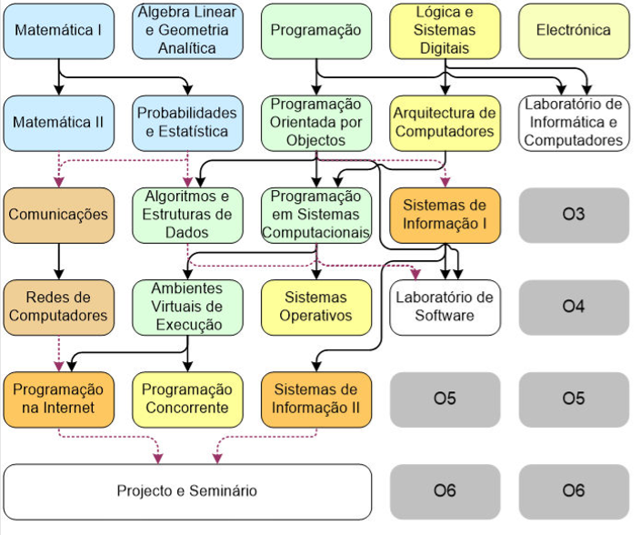

# BachelorsDegree-ISEL
This repository contains all the assignments from my 3-year Bachelor's Degree (Licenciatura) @ ISEL (Instituto Superior de Engenharia de Lisboa) 2016-2020

It is organized by year, semester and subject. For every subject it was included its 'FUC' (Ficha de Unidade Curricular) which includes the syllabus, as well as the grade I received in subject.

The diagram of the bachelors program:

The grades for the subjects were as follows:

# 1st Year

## 1st Semester
Eléctronica - 16/20

Lógica e Sistemas Digitais - 17/20

Programação - 16/20

## 2nd Semester
Arquitectura de Computadores - 17/20

Laboratório de Informática e de Computadores - 14/20

Programação Orientada por Objectos  - 13/20

# 2nd Year

## 3rd Semester
Algoritmos e Estruturas de Dados - 17/20

Comunicações - 13/20

Economia e Gestão de Projecto - 13/20

Programação em Sistemas Computacionais - 14/20

Sistemas de Informação I - 16/20

## 4th Semester
Ambientes Virtuais de Execução - 19/20

Laboratório de Software - 16/20

Modelação e Padrões de Desenho - 12/20

Redes de Computadores - 14/20

Sistemas Operativos - 14/20

# 3rd Year

## 5th Semester
Programação Concorrente - 14

Programação na Internet - 17

Programação de Dispositivos Móveis - 16/20

Redes de Internet - 13/20

Sistemas de Informação II - 16/20

Teoria de Jogos - 16/20

## 6th Semester
Projecto e Seminário - *Summer semester 2019/2020*

Lógica e Computação - 14/20

Segurança Informática - 16/20
